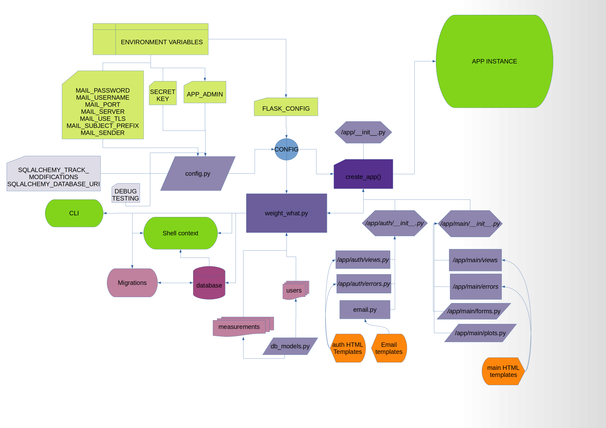

# WeightWhat

## Elevator pitch intro

a project to fool around with Flask extensions and dbs. Also w weight watch-like app.

## Requirements and dependencies
- Python 3.6 (tested)
- Flask  

## Directory and file structure

This is the vanilla directory structure for the template:

    .
        ├── app
        ├── config.py
        ├── migrations
        ├── README.md
        ├── requirements.txt
        ├── tests
        └── weight_what.py

Quick directory and file legend:
- **root**: main directory for the project as a whole
- **app**: houses the app with all it's sections and the app 
factory function
- **config.py**: class based configuration, with some config 
variables read in from env variables 
- **tests**: unittest tests
- **migrations**: Alembic migrations for the db
- **weight_what.py**: main orchestration file

## App architecture 

**weight_what.py**:
1. creates the app instance using the **config.py** definitions
2. initiates the datepicker and Migrate extensions
3. makes shell context??? (I think this is for the CLI db management)
4. setup procedure with @before_first_request - create db
5. adds tests to CLI, so you can execute tests

**./app/\__init\__.py**:
1. stores the app factory function and actually instantiates the app with 
config name provided by **weight_what.py**
2. imports most of the extensions (apart from Migrate and datepicker)
3. Adds previously loaded extensions to app
4. imports blueprints and registers them with the app instance 
(main and auth blueprints)
5. registers the Login Manager with the auth blueprint (at auth.register)                                                                           

## How Blueprints work? (Rambling version)
Blueprints work as an intermediary grouping layer for view functions and
error handlers. If you break up your app into functional sections (say,
picture storage, picture upload, user profile settings), you can have a 
bunch of views/error handlers for each section. Instead of importing them
all and registering with the app itself, we register them with blueprints
for each section and then register the blueprints with the app in the main
app factory function (here - in **./app/\__init\__.py**).

The twist is in the fact, that you first instantiate the Blueprint and
then use the instance reference imported in the files defining the view
functions and error handlers, which looks circular but is not really.
The views and handlers are not executed until Bluprint imports them, at
which point they are decorated to register with the Blueprint's instance.

## Installation

### 1. Download

### 2. Checking the installation

## Use cases 

## Further development 

## FAQ

**Q**: 

**A**:

## References
